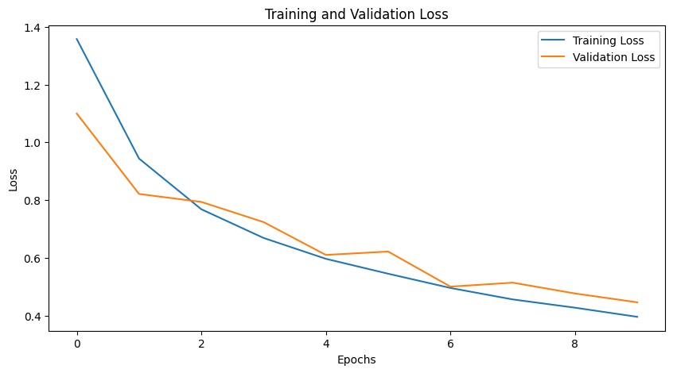
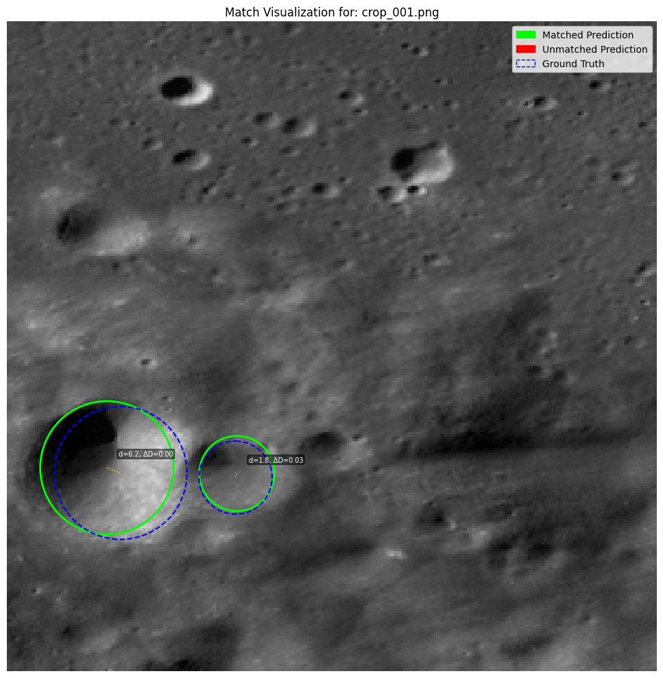
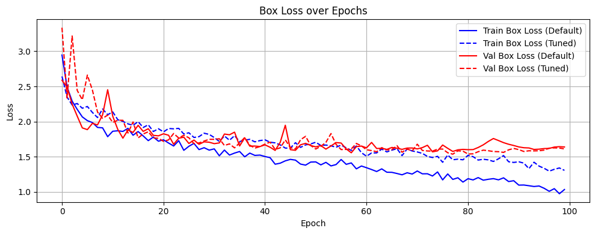

# Computer Vision & Deep Learning

Portfolio version of coursework exploring image classification, transfer learning, and object detection.

## CIFAR-10 classification

The classification work covers custom convolutional neural networks, class-level Precision/Recall/F1 evaluation, architecture and batch-size experiments, and ResNet transfer learning.

- Initial CNN: **62.6% test accuracy**, macro F1 **0.61**
- Improved CNN: **82.98% test accuracy**, macro F1 **0.83**
- ResNet experiments: pretrained ResNet-18, transfer-learned ResNet-18, and ResNet-101
- The transfer-learned ResNet-18 performed best among the tested ResNet configurations

## Lunar crater detection

A YOLOv8 workflow was used for lunar-crater object detection, including raster/image preparation, YOLO-format annotations, model training, Precision/Recall evaluation, mAP@0.5 analysis, hyperparameter tuning, and performance analysis by crater diameter.

- Default training: mAP@0.5 approximately **0.42**
- Tuned training: mAP@0.5 approximately **0.44**

## Visualizations

### CNN classification performance

The classification experiments compare the performance of the CNN models and illustrate the improvement achieved through architecture refinement.

### YOLOv8 crater detection

Example crater detections produced by the YOLOv8 object-detection workflow.

### YOLO training performance

Training and evaluation results for the crater-detection model, including the metrics used to assess object-detection performance.

## Technologies

Python · PyTorch · torchvision · NumPy · pandas · Matplotlib · scikit-learn · YOLOv8 · Rasterio · Pillow

## Data

Large source datasets and generated model artifacts are not included in this repository.

## Notes

This repository presents selected work from a Technion machine-learning course in a concise portfolio format.

## Author

**Yuval Fisher**  
M.Sc. candidate, Mapping and Geoinformation Sciences  
Technion – Israel Institute of Technology
